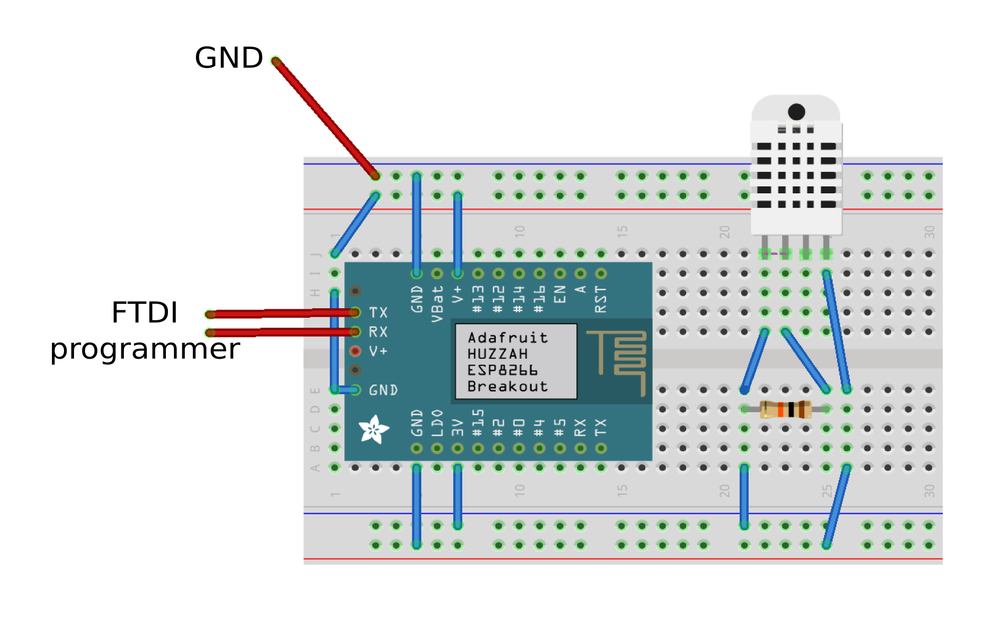

# ESP DHT22 to Emoncms Example

An example made using the [Adafruit Huzzah](https://www.adafruit.com/product/2471) board with ESP-12 module and the DHT22 temperature humidity sensor.

This code example, when loaded onto the ESP will continuously upload temperature and humidity data onto [emoncms.org](https://emoncms.org)

CP2102 USB to UART programming module was used as power supply and to program. 

