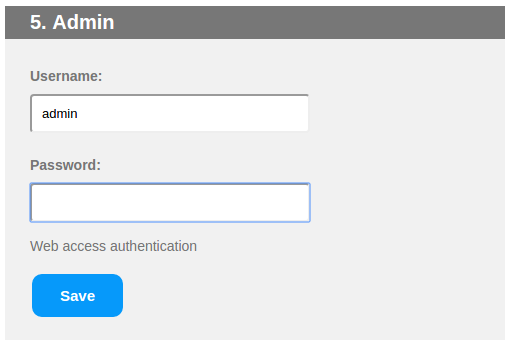
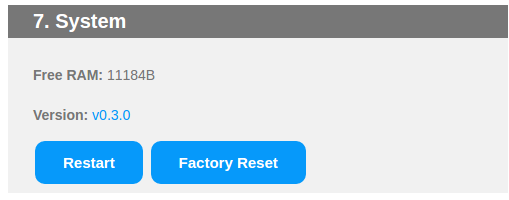

# EmonESP

[](https://travis-ci.org/openenergymonitor/EmonESP)

ESP8266 WIFI serial to emoncms link


## Requirements

- ESP-12E module with 4M Flash

***

# EmonESP User Guide

## First Setup

On first boot, ESP should broadcast a WiFI AP `emonESP_XXX`. Connect to this AP and the [captive portal](https://en.wikipedia.org/wiki/Captive_portal) should forward you to the log-in page. If this does not happen navigate to `http://192.168.4.1`

*Note: You may need to disable mobile data if connecting via a Android 6 device*

### 1. WiFi Connection


- Select your WiFi network from list of available networks
- Enter WiFi PSK key then click `Connect`


- emonESP should now connect to local wifi network and return local IP address.
- Browse to local IP address by clicking the hyperlink (assuming your computer is on the same WiFi network)
On future boots EmonESP will automatically connect to this network.

*Note on some networks it's possible to browse to the EmonESP using hostname [http://emonesp.local](http://emonesp.local), this seems to work on windows but not on Linux*

**If re-connection fails (e.g. network cannot be found) the EmonESP will automatically revert back to WiFi AP mode after a short while to allow a new network to be re-configued if required. Re-connection to existing network will be attempted every 5min.**

E.g Connected to WiFi network with SSID `OpenEnergyMonitor` with local IP `10.0.1.93`:


## 2. Emoncms


EmonESP can post data to [emoncms.org](https://emoncms.org) or any other  Emoncms server (e.g. emonPi) using [Emoncms API](https://emoncms.org/site/api#input).

Data ca be posted using HTTP or HTTPS. For HTTPS the Emoncms server must support HTTPS (emoncms.org does, emonPi does not).Due to the limited resources on the ESP the SSL SSH-1 fingerprint for the Emoncms server must be manually entered and regularly updated.

*Note: the emoncms.org fingerprint will change every 90 days when the SSL certificate is renewed.*

**Currently emoncms.org only supports numerical node names, other emoncms servers e.g. emonPi do support alphanumeric node naming.**


## 3. MQTT


EmonESP can post data to an MQTT server. Each data key:pair value will be published to a sub-topic of base topic.E.g data `CT1:346` will results in `346` being published to `<base-topic>/CT1`

- Enter MQTT server host and base-topic
- (Optional) Enter server authentication details if required
- Click connect
- After a few seconds `Connected: No` should change to `Connected: Yes` if connection is successful. Re-connection will be attempted every 10s.

*Note: `emon/xxxx` should be used as the base-topic if posting to emonPi MQTT server if you want the data to appear in emonPi Emoncms. See [emonPi MQTT docs](https://guide.openenergymonitor.org/technical/mqtt/).*


## 5. Admin (Authentication)

HTTP Authentication (highly recomended) can be enabled by saving admin config by default username and password

**HTTP authentication is required for all HTTP requests including input API**



## 7. System

Displays free system memory and firmware version



## OTA Firmware Update

TBC

## HTTP API Examples

### View units status:

`http://<IP-ADDRESS>/status`

Example return in JSON:

```
{"mode":"STA","networks":[],"rssi":[],"ssid":"OpenEnergyMonitor","srssi":"-58","ipaddress":"10.0.1.93","emoncms_server":"emoncms.org","emoncms_node":"emonesp","emoncms_apikey":"xxxxxxxx","emoncms_connected":"0","packets_sent":"0","packets_success":"0","mqtt_server":"emonpi","mqtt_topic":"emonesp","mqtt_user":"emonpi","mqtt_pass":"xxxxxx","mqtt_connected":"0","free_heap":"25040"}
```

### 4. Data Input

Data can be inputed to EmonESP via serial UART (9600 baud) or HTTP API:


*Previously called `test`, renamed to `input` since this is a useful method to input a data string to be posted to Emoncms & MQTT*

`http://<IP-ADDRESS>/input?string=CT1:3935,CT2:325,T1:12.5,T2:16.9,T3:11.2,T4:34.7`

### Save Emoncms server details

`http://<IP-ADDRESS>/saveemoncms?&server=emoncms.org&apikey=xxxxxxxxxxxxxxxxxx&node=emonesp&fingerprint=7D:82:15:BE:D7:BC:72:58:87:7D:8E:40:D4:80:BA:1A:9F:8B:8D:DA`

*SSL SHA-1 fingerprint is optional, HTTPS connection will be enabled if present*

### Save Emoncms MQTT server details

`http://<IP-ADDRESS>/savemqtt?&server=emonpi&topic=emonesp&user=emonpi&pass=emonpimqtt2016`

*MQTT user and pass are optional, leave blank for connection to un-authenticated MQTT servers*

***

## Installation

EmonESP uses [ESP8266 Arduino core](https://github.com/esp8266/Arduino)

Firmware can be compiled and uploaded either using PlatfomIO ([see blog post](https://blog.openenergymonitor.org/2016/06/platformio/)) or Arduino IDE.


### Option 1: Using PlatformIO

For more detailed ESP8266 Arduino core specific PlatfomIO notes see: https://github.com/esp8266/Arduino#using-platformio

#### 1a. Install PlatformIO command line

The easiest way if running Linux is to install use the install script, this installed pio via python pip and installs pip if not present. See [PlatformIO installation docs](http://docs.platformio.org/en/latest/installation.html#installer-script). Or PlatformIO IDE can be used :

`$ sudo python -c "$(curl -fsSL https://raw.githubusercontent.com/platformio/platformio/master/scripts/get-platformio.py)"`

#### 1b. And / Or use PlatformIO IDE

Standalone built on GitHub Atom IDE, or use PlatformIO Atom IDE plug-in if you already have Atom installed. The IDE is nice, easy and self-explanitory.

[Download PlatfomIO IDE](http://platformio.org/platformio-ide)

#### 2. Clone this repo

`$ git clone https://github.com/openenergymonitor/EmonESP`

#### 3. Compile

```
$ cd EmonESP
$ pio run
```

The first time platformIO is ran the espressif arduino tool chain and all the required libs will be installed if required.


#### 3. Upload

- Put ESP into bootloader mode
   - On Heatpump monitor use jumper to pull `GPIO0` low then reset then connect power (simulates reset) or pull RST pin low.
   - On other ESP boards (Adafruit HUZZAH) press and hold `GPIO0` button then press Reset, LED should light dimly to indicate bootloader mode

##### a.) Upload main program:

`$ pio run -t upload`

##### b.) Upload data folder to the file system (html, CSS etc.) (SPIFFS):

- Put ESP back into bootloder mode, see above

`$ pio run -t uploadfs`

See [PlatfomrIO docs regarding SPIFFS uploading](http://docs.platformio.org/en/latest/platforms/espressif.html#uploading-files-to-file-system-spiffs)

##### c.) OTA upload over local network

`$  pio run  -t upload --upload-port <LOCAL-ESP-IP-ADDRESS>`

Upload SPIFFS filesystem over OTA (and don't flash):

` pio run -e emonesp_spiffs -t upload --upload-port <LOCAL-ESP-IP-ADDRESS>`

OTA uses port 8266. See [PlatformIO ESP OTA docs](http://docs.platformio.org/en/latest/platforms/espressif.html#over-the-air-ota-update):


#### 4. Debugging ESP subsystems

The ESP subsystems have a lot of logging that can be enabled via setting various build options.

Using Platform IO the easiest way to configure these is via the [PLATFORMIO_BUILD_FLAGS](http://docs.platformio.org/en/stable/envvars.html#envvar-PLATFORMIO_BUILD_FLAGS) environment variable.

First select the serial port to output debug;
```
-DDEBUG_ESP_PORT=Serial
-DDEBUG_ESP_PORT=Serial1
```

Then add one or more of the debug options;
```
-DDEBUG_ESP_CORE
-DDEBUG_ESP_WIFI
-DDEBUG_ESP_HTTP_CLIENT
-DDEBUG_ESP_HTTP_SERVER
-DDEBUG_ESP_HTTP_UPDATE
-DDEBUG_ESP_UPDATER
-DDEBUG_ESP_OTA
-DDEBUG_ESP_SSL
-DDEBUG_TLS_MEM
```

For example from the Windows Power shell you may do something like;
```
$env:PLATFORMIO_BUILD_FLAGS="-DDEBUG_ESP_PORT=Serial1 -DDEBUG_ESP_CORE -DDEBUG_ESP_WIFI"
pio run -t clean
pio run
pio run -t upload --upload-port 172.16.0.80
```

***

### Option 2: Using Arduino IDE

#### 1. Install ESP for Arduino IDE with Boards Manager

Install steps from: https://github.com/esp8266/Arduino

- Install Arduino IDE 1.6.8 from the Arduino website.
- Start Arduino and open Preferences window.
- Enter `http://arduino.esp8266.com/stable/package_esp8266com_index.json` into Additional Board Manager URLs field. You can add multiple URLs, separating them with commas.
- Open `Tools > Board > Board Manager`, scroll down and click on esp8266 platform, select version then install
- Select `Tools > Board > Generic ESP8266 Module` (required for EmonESP)

#### 2. Install ESP filesystem file uploader

Required to include `data` folder with HTML etc in the upload

[Follow esp8266 filesystem instructions (copied  below):](https://github.com/esp8266/Arduino/blob/master/doc/filesystem.md)

- [Download the Arduino IDE plug-in (.zip)](https://github.com/esp8266/arduino-esp8266fs-plugin/releases/download/0.2.0/ESP8266FS-0.2.0.zip)
- Navigate to the `tools` folder in your Arduino sketchbook directory, (create directory if it doesn't exist)
- Create `tools > ESP8266FS` folder
- Unpack the plug-in into `ESP8266FS` directory (the path will look like `<home_dir>/Arduino/tools/ESP8266FS/tool/esp8266fs.jar`)
- Restart Arduino IDE

#### 3. Clone this repo

`$ git clone https://github.com/openenergymonitor/EmonESP`

#### 4. Compile and Upload

- Open src/src.ino in the Arduino IDE.
- Put ESP into bootloader mode
   - On Heatpump monitor use jumper to pull `GPIO0` low then reset then connect power (simulates reset)
   - On other ESP boards (Adafruit HUZZAH) press and hold `GPIO0` button then press Reset, LED should light dimly to indicate bootloader mode
- **Upload main sketch:** Compile and Upload as normal using Arduino IDE [CTRL + u]
- **Upload 'data' folder**: Upload data folder (home.html web page etc) using `tools > ESP8266 Sketch Data Upload tool`.

***

### Development Forum Threads

- https://community.openenergymonitor.org/t/emonesp-firmware-development/1191/43
- https://community.openenergymonitor.org/tags/emonesp

### License

GNU V3 General Public License